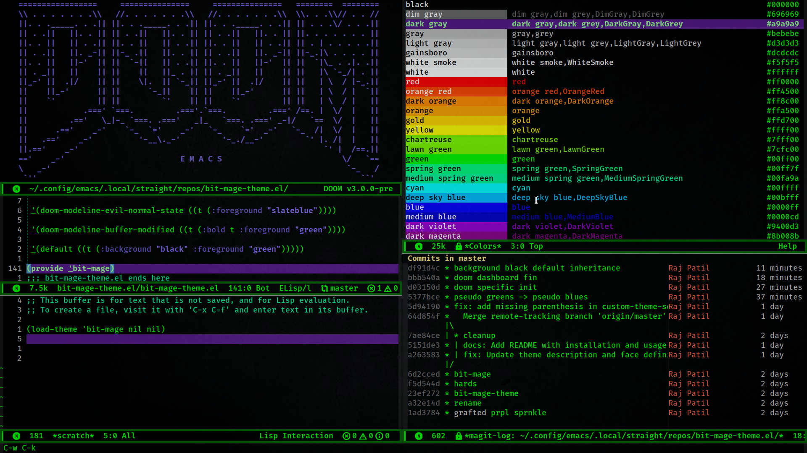

# (Bit-Mage)

## **Cyber Medieval Sourceror's Cave**



## Installation

Clone this repository to a local directory:

```sh
git clone https://github.com/rajp152k/bit-mage-theme.git
```

Then, add the following to your `init.el` to add the theme to your `custom-theme-load-path`:

```elisp
(add-to-list 'custom-theme-load-path "/path/to/bit-mage-theme")
```

Make sure to replace `/path/to/bit-mage-theme` with the actual path to where you cloned the repository.

## Usage

Load the theme with:

`M-x load-theme RET bit-mage RET`

To load it automatically on startup, add this to your `init.el`:

```elisp
(load-theme 'bit-mage t)
```
