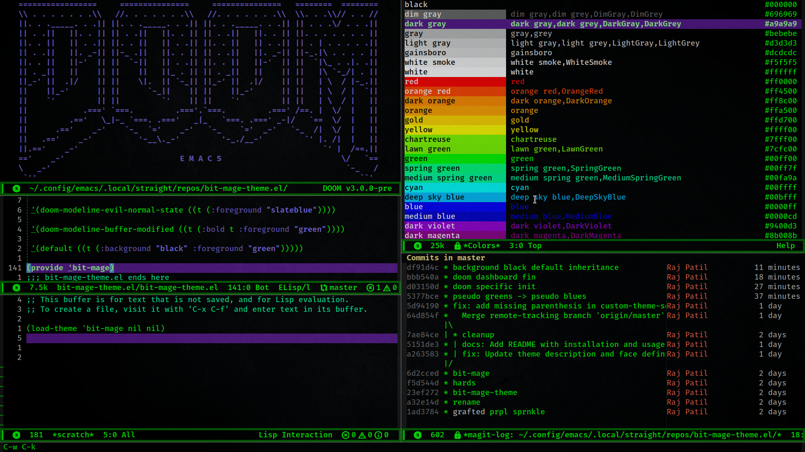
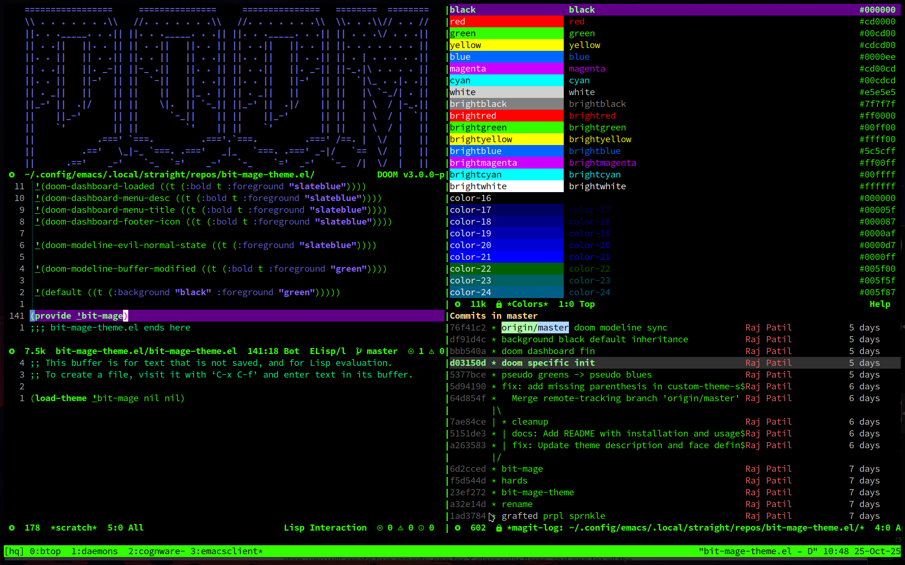
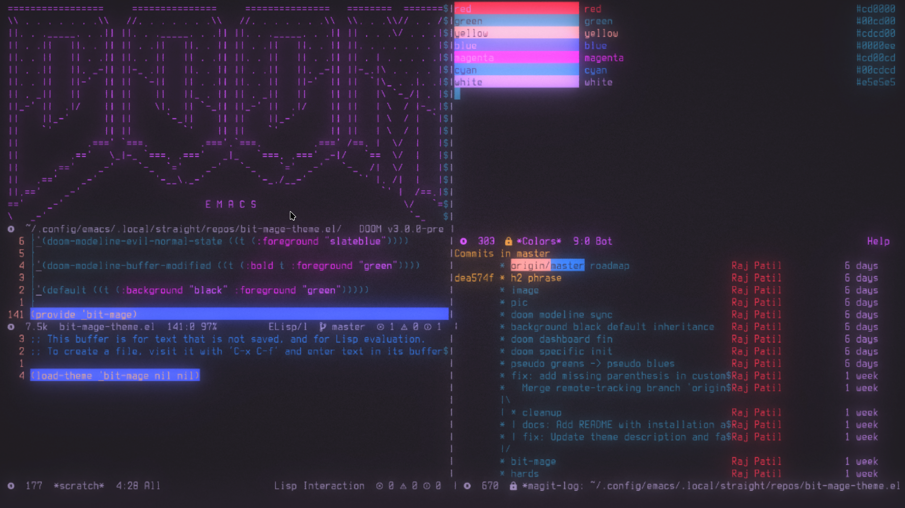

# (Bit-Mage)

[](https://github.com/rajp152k/bit-mage-theme.el/actions/workflows/test.yml)

## **Cyber Medieval Sourceror's Cave**

A dark cyberpunk Emacs theme with neon green and slateblue accents. Designed for the hacker wizard aesthetic.

## Philosophy

**"Cyber Medieval Sourceror's Cave"**

Bit-Mage draws inspiration from:
- The neon-green Matrix aesthetic of terminal hacking
- Medieval grimoires and arcane study chambers
- Live coding environments like Emacs Live and Overtone
- The focused concentration of late-night coding sessions

### Design Principles

1. **Low-light optimized**: Deep blacks and muted backgrounds reduce eye strain
2. **Semantic color hierarchy**: Greens for code, blues for structure, purples for accents
3. **Live-coding focused**: Clear visual feedback for evaluation and debugging
4. **Keyboard-centric**: No UI chrome, maximum code visibility

## Color Palette

| Role | Color | Hex | Usage |
|------|-------|-----|-------|
| Background | void | gray1 | Main editing area |
| Foreground | neon green | #00FF00 | Primary text |
| Accent 1 | slateblue | slateblue | Structure, types |
| Accent 2 | spring green | spring green | Success, strings |
| Warning | orange | #ffaf00 | Warnings, modified |
| Error | red | #ff5f5f | Errors, failures |

> See the full palette (~30 color variables) in [`bit-mage-theme.el`](bit-mage-theme.el#L32-L78).

## Screenshots

### GUI



### CLI (-nw)



### Cool Retro Term



### Live Coding (CIDER)

*Screenshot coming soon — CIDER faces now fully themed!*

## Installation

Clone this repository to a local directory:

```sh
git clone https://github.com/rajp152k/bit-mage-theme.git
```

Then, add the following to your `init.el` to add the theme to your `custom-theme-load-path`:

```elisp
(add-to-list 'custom-theme-load-path "/path/to/bit-mage-theme")
```

Make sure to replace `/path/to/bit-mage-theme` with the actual path to where you cloned the repository.

## Usage

Load the theme with:

`M-x load-theme RET bit-mage RET`

To load it automatically on startup, add this to your `init.el`:

```elisp
(load-theme 'bit-mage t)
```

## Customization

### Adjusting Colors

The theme uses `let*` binding for all colors. Fork and modify:

```elisp
(let* ((bg-void "gray1")        ; Change background here
       (fg-main "green")        ; Change foreground here
       ...)
```

### Recommended Complementary Packages

- `rainbow-delimiters` - Paren depth highlighting
- `highlight-indent-guides` - Indentation visualization
- `doom-modeline` - Themed modeline (faces included)

## Inspiration

| Theme | Influence |
|-------|-----------|
| Cyberpunk (emacs-live) | Live coding optimizations |
| Doom One | Modern Doom integration |
| Zenburn | Low-contrast philosophy |
| Gruber Darker | Minimalist approach |

## Roadmap

- Progressively covering popular packages' faces for uniformity
- AI-reactive generative music integration (experimental)
- Suggestions welcome — [open an issue](https://github.com/rajp152k/bit-mage-theme.el/issues)
